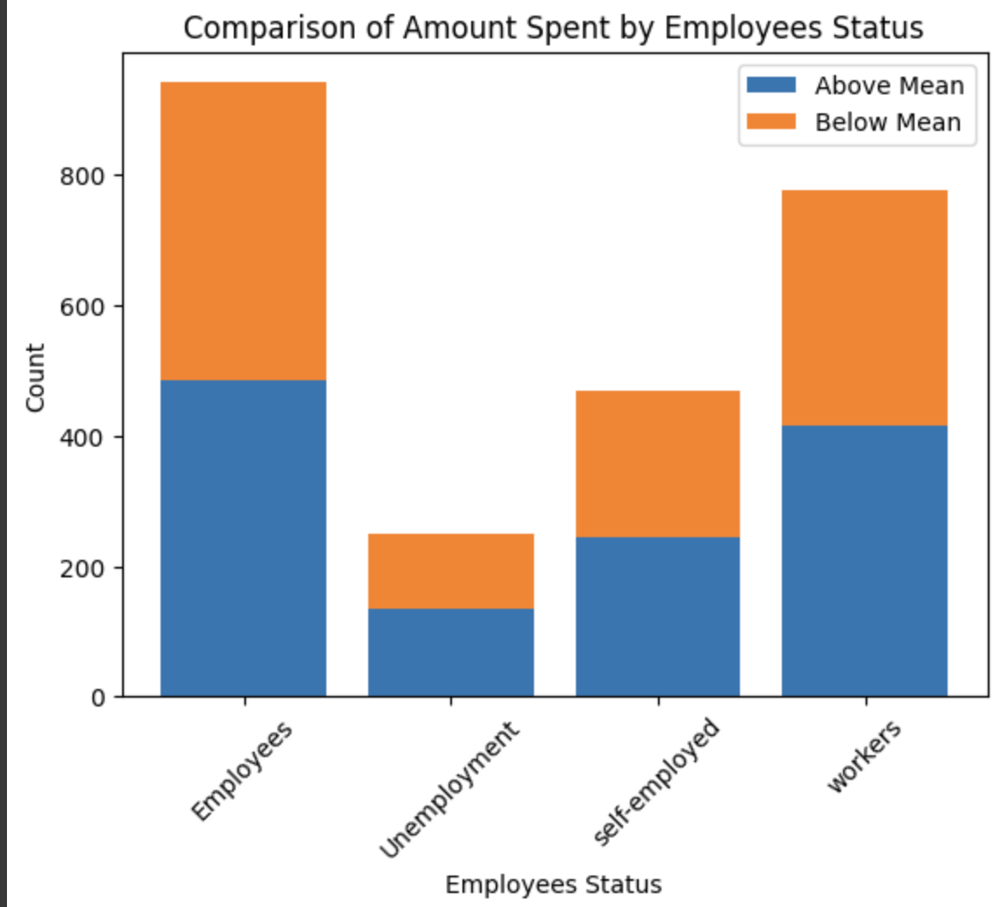
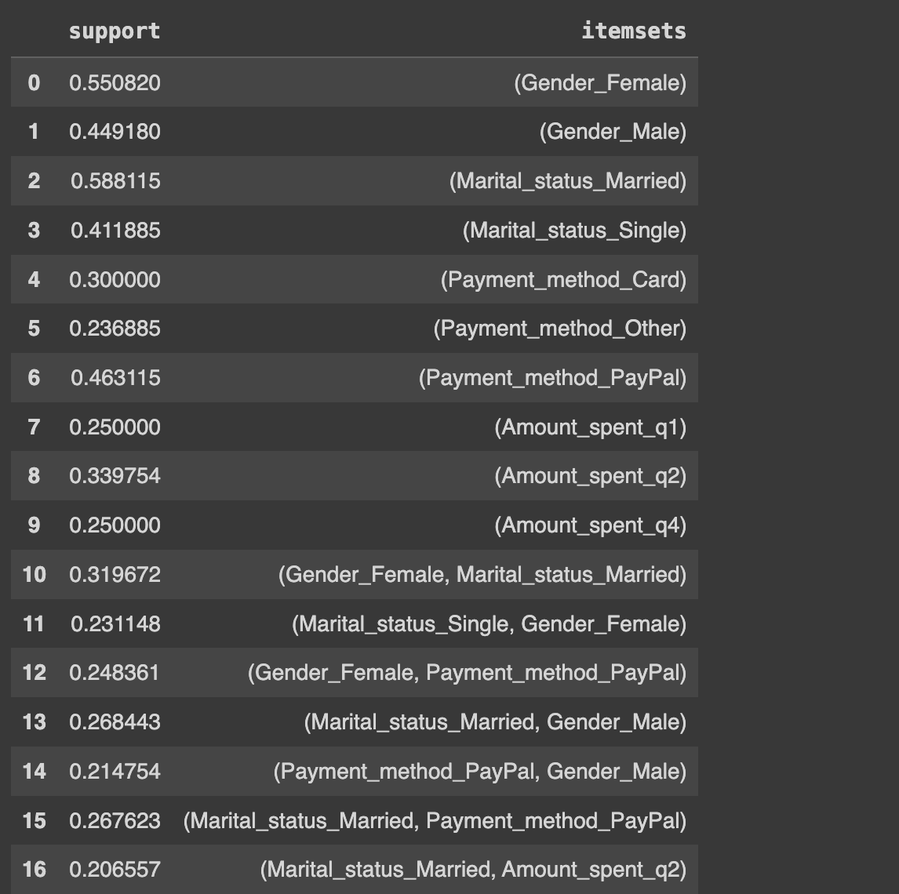
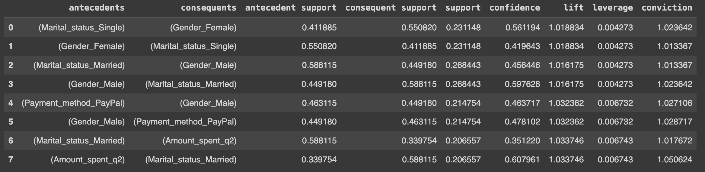
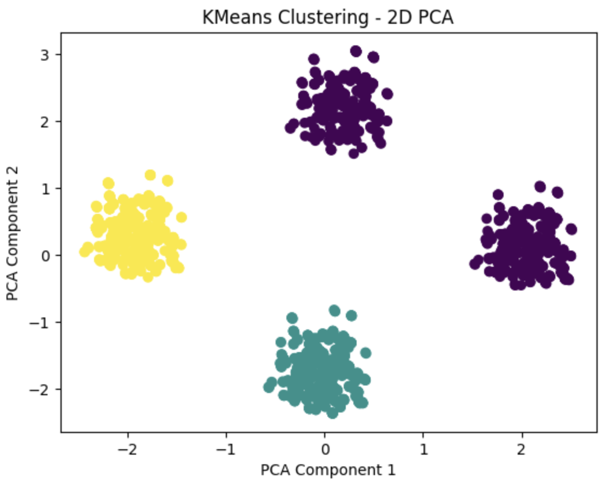
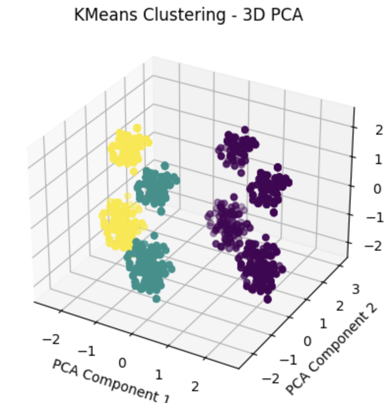

# Online Customers

This repository serves as the culmination of our work in the "Fundamentals of Data Mining" course at Ferdowsi University of Mashhad. Here, we leverage the data mining techniques and algorithms we've acquired throughout the course to gain valuable insights from an online customer dataset. This project encompasses several key components:

## Data Preprocessing
In the initial phase, we focus on preparing the dataset for analysis. This involves various tasks such as handling missing data, converting categorical data into numerical representations, and normalizing the data. These steps are essential for ensuring the quality of our analysis.

## Customer Spending Analysis
In this phase, we delve into understanding the relationship between customers' employment status and the amount they spend. We compare different employment statuses and their spending habits with the mean amount spent. This analysis helps us identify which types of customers tend to spend more, enabling us to target our advertising efforts more effectively.

## Customer Behaviour Analysis
Using the Apriori algorithm, we extract frequent item sets from the dataset. Subsequently, we derive association rules from these item sets. This step allows us to uncover patterns and associations among the customer behaviours, offering valuable insights for product recommendations and marketing strategies.

## Customer Clustering
Customer segmentation is a crucial part of our project. We apply various techniques, including K-means and DBSCAN algorithms, to cluster the customers based on their behavior and characteristics. Through rigorous evaluation, we find that the K-means algorithm outperforms DBSCAN, and we visualize the customer clusters using PCA in both 2D and 3D representations.

## Customer Classification
In the final stage, we employ various classification algorithms to assign a customer segment to new customers based on their referral and spending patterns. Our analysis reveals that the Support Vector Machine (SVM) algorithm achieves the highest accuracy of 45.9%, making it a promising choice for categorizing customers effectively.

This project provides a comprehensive overview of the capabilities of data mining in extracting meaningful insights and facilitating informed business decisions. Feel free to explore our work and the code within this repository to gain a deeper understanding of our data mining journey. If you have any questions or feedback, please don't hesitate to reach out.